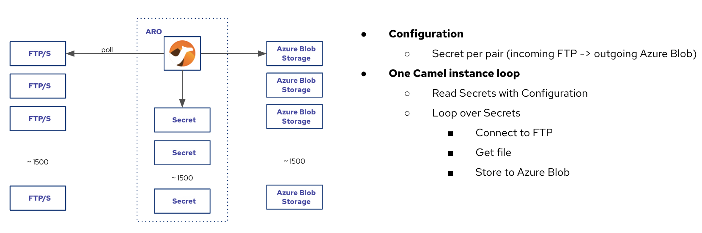
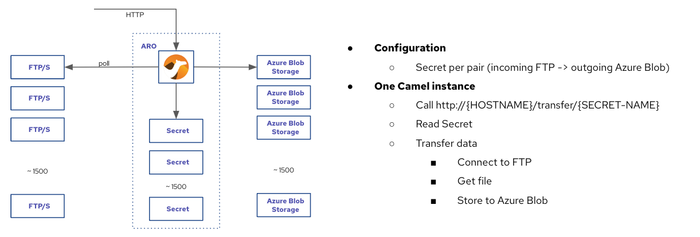

# Camel-Quarkus: from FTP to Azure Blob

### Requirements
 - up to 1500 sources FTP/S (different server, username, password, etc)
- Dozen of files per sources per day
- Azure Blob as target
- Configurable sources (add new, change, etc)
- Reduce resource consumption

### Architecture 
Option 1: Loop over secrets. Set application.properties property
```properties
transfer.loop=true
```


Option2. Start over HTTP. Set application.properties property
```properties
transfer.loop=false
```


## Demo infrastructure
OpenShift 4.10

## How to
1. Create FTP servers and Azure blob containers
2. Set FTP servers and Azure blob containers configuration in `manifes/pipes.yaml` as Secrets
3. Deploy manifests
```bash
oc apply -k manifests
```
4. Deploy application
```bash
mvn clean package -Dquarkus.kubernetes.deploy=true
```
5. Call transfer
```bash
curl http://${HOSTNAME}/transfer/${SECRET-NAME} 
```